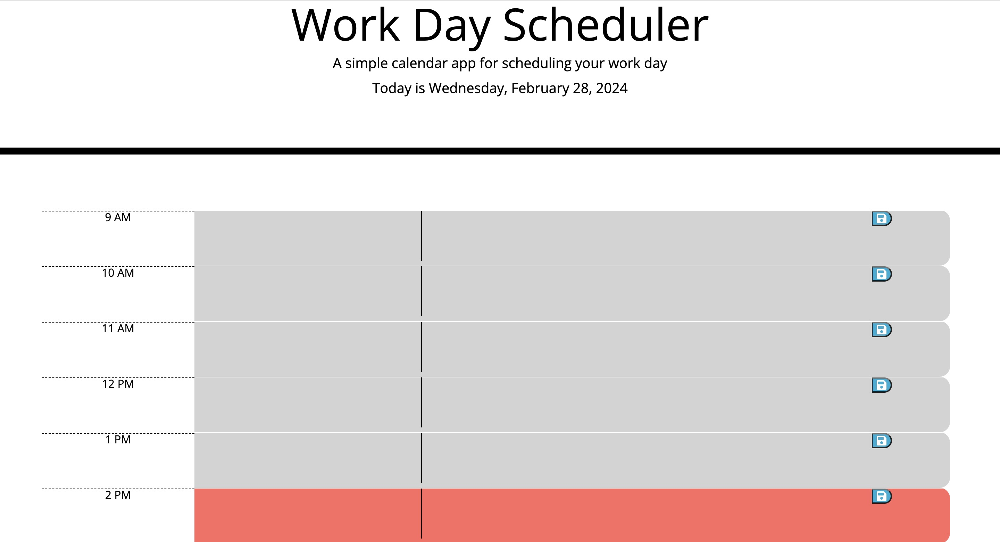

# Work Day Scheduler App

## Description

The Work Day Scheduler is a web application designed to help users organise their work tasks and manage their daily schedules effectively. It provides a simple and intuitive interface for users to add, edit, and save tasks. The scheduler is tailored specifically for work-related tasks, allowing users to prioritize their workload and stay on top of deadlines.

Link to the deployed application: https://m-maha21.github.io/myfirst-workday-planner/ 

## Screenshot 
The following image shows the web application's appearance and functionality:

    
## Table of Contents 

- [Description](#description)
- [Screenshot] (#screenshot)
- [Installation](#installation)
- [Usage](#usage)
- [License](#license)
- [Contribution](#contribution)
- [Credits](#credits)
- [Tools](#tools)

## Installation

To install my Work Day scheduler app from my GitHub repository, you need to follow these steps:
1. Clone the repository: you can do this by using the git clone command followed by the URL of the repository.
2. Navigate to the Repository Directory: use the cd command to navigate into the directory of the cloned repository
3. Run the Scheduler: once you've cloned the repository and configured the project (if necessary), you should be able to run the Workday scheduler.
4. Test: after installation, it's a good practice to test the scheduler to ensure it's working as expected. Create some test schedules or tasks to verify its functionality.

## Usage

The time-blocks are color-coded to help users identify the upcoming, current and past events.

## License
MIT

## Contribution

N/A

## Credits

Name: Mahamuda
GitHub: m-maha21

## Tools

The tools that I have used in project are: JavaScript, CSS, HTML and Local Storage

